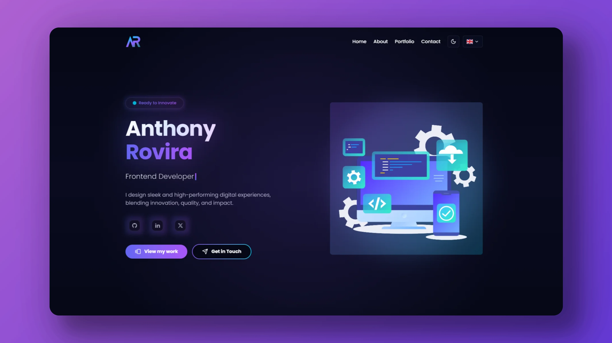

[](https://github.com/anthonyrovira/portfolio/actions/workflows/deploy-frontend.yml)

# Anthony Rovira - Personal Portfolio 🚀



## 🌟 Overview

Welcome to my personal portfolio! This modern, responsive web application showcases my journey as a Frontend Developer through an engaging and interactive experience. Visit [my portfolio](https://anthonyrovira.com) to explore my projects and learn more about my expertise.

## ✨ Key Features

- 🎨 Modern and sleek UI design with smooth animations
- 🌓 Dark/Light mode support
- 📱 Fully responsive across all devices
- ⚡ Lightning-fast performance
- 🔄 Dynamic content loading
- 🌍 Multilingual support (English, French, Spanish)
- 📊 Project showcase with live demos
- 📝 Contact form with validation

## 🛠️ Built With

This portfolio is crafted with modern technologies and best practices:

- **Frontend Framework**: [React 18](https://reactjs.org/) with [TypeScript](https://www.typescriptlang.org/)
- **Build Tool**: [Vite](https://vitejs.dev/) for lightning-fast development
- **Styling**: [TailwindCSS](https://tailwindcss.com/) for responsive design
- **Animations**: [Framer Motion](https://www.framer.com/motion/) for smooth transitions
- **Form Handling**: [React Hook Form](https://react-hook-form.com/) with [Zod](https://zod.dev/) validation
- **Backend & Authentication**: [Firebase](https://firebase.google.com/)
- **Testing**: Vitest for unit testing
- **Code Quality**: ESLint & TypeScript for type safety

## 🚀 Performance

- Optimized asset loading
- Lazy-loaded components
- Efficient state management
- 90+ Lighthouse score

## 🏃‍♂️ Running Locally

```bash
# Clone the repository
git clone https://github.com/anthonyrovira/portfolio.git

# Navigate to the project directory
cd portfolio

# Install dependencies
pnpm install

# Start the development server
pnpm dev
```

## 📫 Contact

Feel free to reach out if you're interested in working together or have any questions:

- **Email**: [anthonyrov@gmail.com](mailto:anthonyrov@gmail.com)
- **LinkedIn**: [/anthonyrovira](https://www.linkedin.com/in/anthonyrovira/)
- **GitHub**: [/anthonyrovira](https://github.com/anthonyrovira)

## 📄 License

This project is licensed under the MIT License - see the [LICENSE](LICENSE) file for details.

---

<p align="center">Designed & Built with ❤️ by Anthony Rovira</p>
